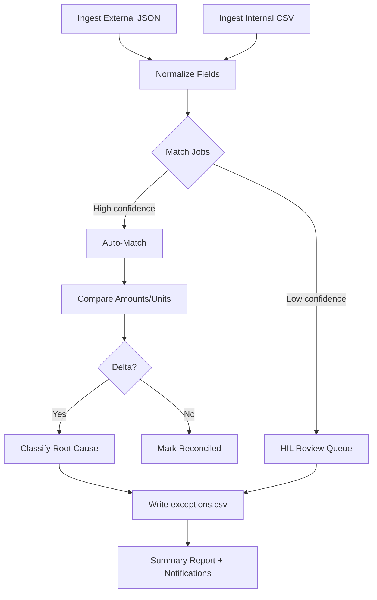

# Architecture & Matching Flow (Mermaid)

```mermaid
flowchart TD
    A[Ingest External JSON] --> B[Normalize Fields]
    A2[Ingest Internal CSV] --> B
    B --> C{Match Jobs}
    C -->|High confidence| D[Auto-Match]
    C -->|Low confidence| H[HIL Review Queue]
    D --> E[Compare Amounts/Units]
    E --> F{Delta?}
    F -->|No| G[Mark Reconciled]
    F -->|Yes| I[Classify Root Cause]
    I --> J[Write exceptions.csv]
    J --> K[Summary Report + Notifications]
    H --> J
```
